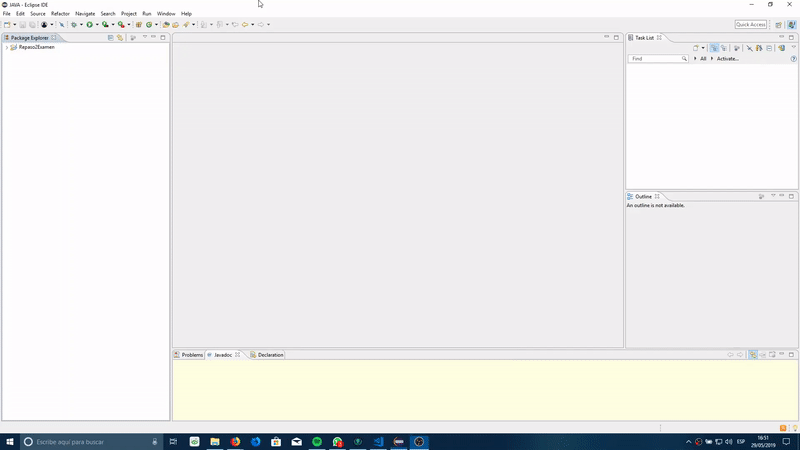

# Prácticas de Teoría de Redes (2018-2019). UPCT

_A continuación podrás ver todas las prácticas resueltas que se realizaron en la asignatura de Teoría de Redes en el curso 2018-2019, también podrás encontrar el manual utilizado y los enunciados de las prácticas._

## Indice 🚀

_A continuación encontrarás un índice con las prácticas que hemos hecho._

* Práctica 1: Introducción a Net2Plan.
* Práctica 2: Introducción al desarrollo de algoritmos de Net2Plan.
* Práctica 3: Introducción al desarrollo de algoritmos de Net2Plan (II).
* Práctica 4: Introducción a la librería Java Optimization Modeler (JOM) con Net2Plan.
* Práctica 5: Enrutamiento del Tráfico. Formulación Flujo-Camino.
* Práctica 6: Encaminamiento del tráfico. Formulaciones Flujo-enlace.
* Práctica 7: Optimización del encaminamiento y la capacidad modulares utilizando una formulación destino-enlace.
* Práctica 8: Congestion control
* Práctica 9: Problema de localización de nodos
* Práctica 10: Problema de diseño de topología, capacidad y encaminamiento (TCFA)

## Software necesario 📋

_Para poder realizar estas prácticas necesitarás una serie de programas y DLLs, que podrás encontrar a continuación_

* Software a instalar
    * [Eclipse IDE for Java Developers](https://www.eclipse.org/downloads/)
    * [Java JDK 8](https://www.oracle.com/technetwork/java/javase/downloads/jdk8-downloads-2133151.html)
    * [Net2Plan 0.5.3](https://github.com/girtel/Net2Plan/releases/download/0.5.3/Net2Plan-0.5.3.zip)

* Solvers
    * 32 bits
        * [GLPK](http://www.net2plan.com/jom/externalsoftware/win32/glpk_4_48.dll)
        * [IPOPT](http://www.net2plan.com/jom/externalsoftware/win32/Ipopt38.dll)
    * 64 bits
        * [GLPK](http://www.net2plan.com/jom/externalsoftware/win64/glpk_4_48.dll)
        * [IPOPT](http://www.net2plan.com/jom/externalsoftware/win64/Ipopt38.dll)

_Guarda los solvers en C:\Windows\System32, es posible que sea necesario copiarlos en la carpeta C:\Windows\system si tienes un sistema de 64 bits._

## Deployment 📦

## Autores ✒️

* **Andrés Ruz Nieto** - *Documentación* - [aruznieto](https://github.com/aruznieto)

## Licencia 📄

Estos archivos no tienen licencia.

## Expresiones de Gratitud 🎁

* Comenta a otros sobre este proyecto 📢
* Invita una cerveza 🍺 a alguien del equipo. 
* Da las gracias públicamente 🤓.
* etc.

---
⌨️ con ❤️ por [aruznieto](https://github.com/aruznieto)😊
